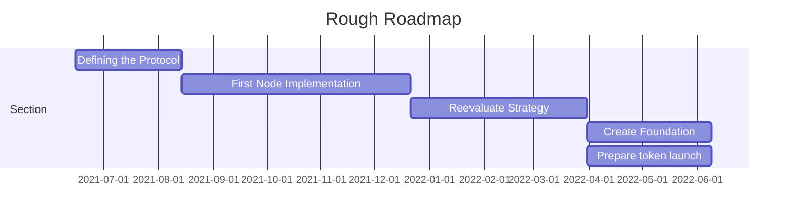

<!-- prettier-ignore -->
!!! warning
    The POG.network specification is still a Work-In-Progress and isn't finalized yet.

# Introduction

POG.network is currently in a very early phase. Currently, we're working hard on formalizing our specification and finding out what we want to actually build. Still, we want to begin building something as soon as we have the basics about right and experiment in software to figure out any problems that might come up.

# What drives us

POG was born out of the desire to learn. The initial team consists of a number of students at the CODE University who want to use this as an opportunity to learn. This started with the relization of the inefficiencies in current cryptocurrencies which got us to make sustainability a core part of the protocol.

We want to realize this goal while still staying true to the original vision of bitcoin: creating a currency that knows no geographical boundaries and which exists outside of the of controll of individual states and companies.

# Previous Work

We're drawing inspiration from many projects, in particualy [ethereum](https://ethereum.org/), [nano](https://nano.org), [vite](https://vite.org) and [nem](https://nem.io).
These are all very mature projects with a huge amount of features, which pog is not: We want to create a minimal and modular project to learn about distributed ledgers and only later expand it to a fully production ready cryptocurrency.

Our Roadmap is available [here](https://github.com/orgs/pognetwork/projects/1) and on the left side you can find our first attempts at defining our protocol.

