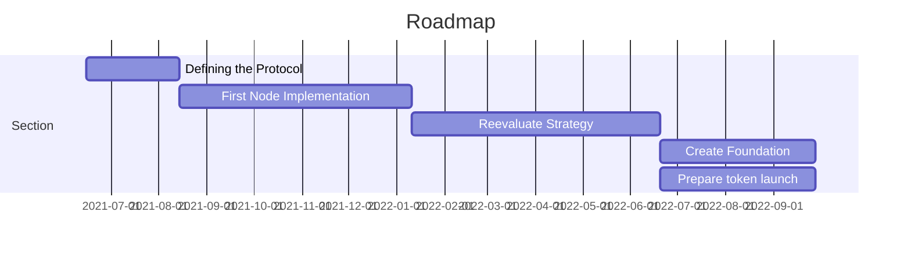

# Introduction

POG.network is still in an early phase. Currently, we're working hard on finalizing our specification and finishing the first working prototype of our reference-implmenetation, champ.

This specification is primarily aimed at develops with a basic understanding of digital ledger technology, so basic programming knowledge and researching certain terms might be required. We also provide a basic [glossary](glossary.md).

# Previous Work

We're drawing inspiration from many projects, in particular [ethereum](https://ethereum.org/), [nano](https://nano.org), [vite](https://vite.org) and [nem](https://nem.io).
These are all very mature projects with a huge amount of features, which pog is not: We want to create a minimal and modular project to learn about distributed ledgers and only later expand it to a fully production ready cryptocurrency.

# Roadmap

Our roadmap is available [here](https://github.com/orgs/pognetwork/projects/1) and on the left side you can find our first attempts at defining a protocol.

