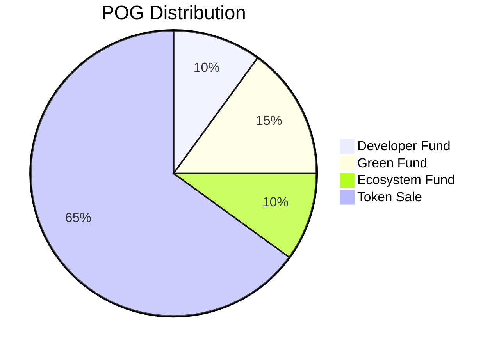

<!-- prettier-ignore -->
!!! warning
    The POG.network specification is still a Work-In-Progress and this page isn't finalized yet.

# The Initial Coin Distribution

## Token Sale

We want to run a campaign where you get POG for donations to climate focused ngo’s, e.g per
planted tree. Users can already generate a wallet before the network launch where said POG will be send with the genesis block.
The amount of generated coins will be relative to the amount of donations in this event.

To encourage individuals from contributing, there will be additional rewards for your first x amound of coins bought.

## Developer Fund

A portion of the funds will be paid out to developers working on the protocol. How this will work isn't set out in stone yet, however this isn't supposed to be a get rich scheme for founders so timelocking and othere mechanisms will definitly play a role.

## Ecosystem Fund

The ecosystem found will be managed by the POG foundation. This foundation will hold regular votes and competions for distributing these coins to projects benefiting the ecosystem like wallets and alternative node implementations.

## Green Fund

This amount of tokens will also be slowly paid out the the foundation for funding climate-centric projects. This will need to happen very transparently and with feedback from the rest of the community.
