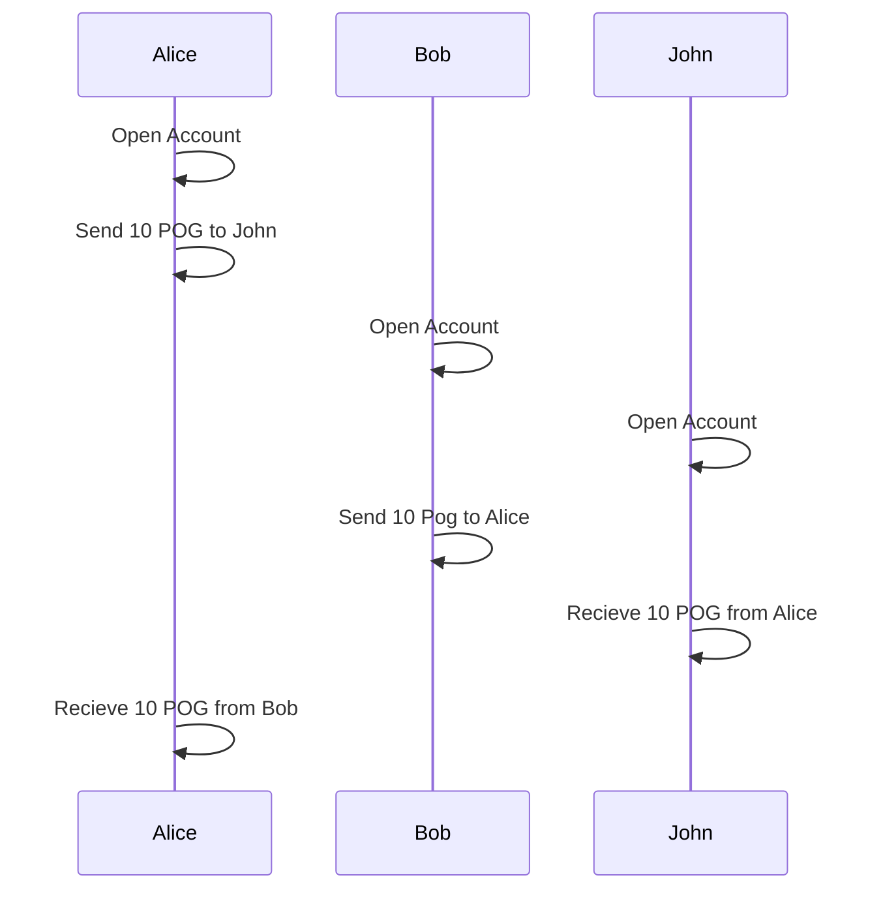

<!-- prettier-ignore -->
!!! warning
    The POG.network specification is still a Work-In-Progress and this page isn't finalized yet.

# Block-lattice

POG uses a form of Directed Acyclic Graphs (DAGs) which is based on a concept pioneered by the nano currency.
In this graph, each account essentially has their own blockchain which can only be controlled with their private key. This enables POG to not 'ellect' leaders like other currencys (e.g miners in bitcoin). This removes a major bottleneck of only one node verifying transactions and improves decentralization through independent verification by all prime delegates.

## The Datastructure

## Accounts

## Blocks
